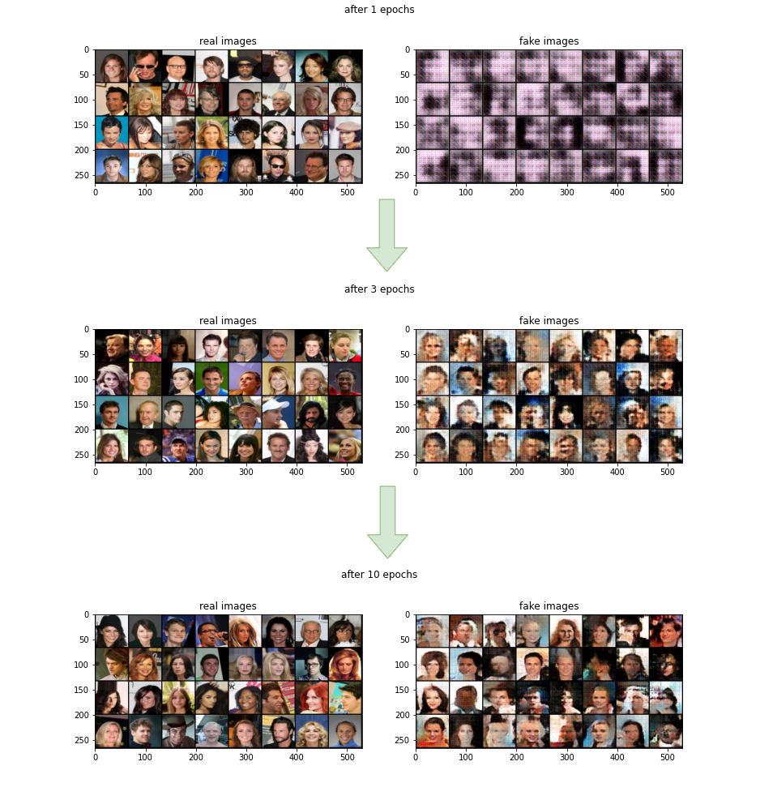

# Implementation-of-Gradient-Penalty-based-Wasserstein-GAN
This repository contains implementation of simple Gradient Penalty based Wasserstein GAN.

* WANDB project can be found [here](https://wandb.ai/hobby_projects/WGAN_implementation?workspace=user-hobby_projects).
<!---* Medium article can be found [here](LINK)--->

## Results throughtout the training:

